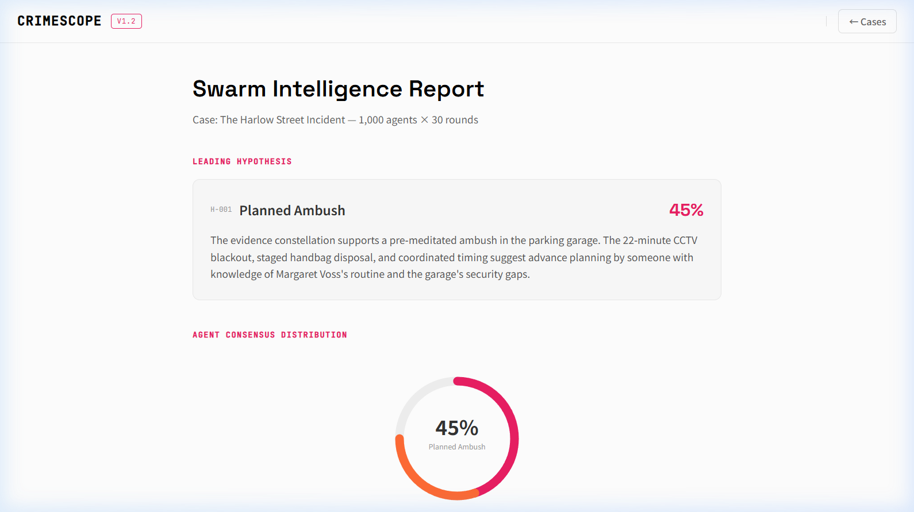

<div align="center">
  
  <h1>CrimeScope</h1>
  <p><b>1,000-Agent Swarm Intelligence Engine for Criminal Event Reconstruction</b></p>
  
  [](https://www.gnu.org/licenses/agpl-3.0)
  [](https://www.python.org/downloads/)
  [](https://vuejs.org/)
  []()
</div>

<br />

---

## 👁‍🗨 The Platform

**CrimeScope** is an advanced swarm intelligence platform designed to reconstruct complex timelines and detect contradictions in criminal investigations. Rather than relying on a single LLM call, CrimeScope spins up an adversarial, 1,000-agent swarm divided into 8 distinct cognitive archetypes.

Agents analyze parsed evidence, develop independent causal chains, cross-examine each other for contradictions, and ultimately converge on the statistical truth using a Bayesian Probable Cause Engine.

<div align="center">
  
</div>

---

## 🔬 Core Mechanics

CrimeScope operates across 3 main ingestion modes:

1. **Photo Evidence**: Gemini 2.5 Pro conducts multi-pass forensic analysis of crime scene imagery, extracting blood spatter patterns, anomalies, and spatial relationships.
2. **Document & Video**: A 3-pass extraction pipeline processes transcripts and police reports to build a highly structured semantic timeline.
3. **Demo Case**: One-click launch investigating the "Harlow Street Incident" locked-room mystery.

### The 1,000-Agent Swarm

A single "Agent" is rarely unbiased. CrimeScope deploys an entire precinct:

| Archetype | Count | Cognitive Role |
|-----------|-------|----------------|
| **Suspect Persona** | 200 | Maps deceptive reasoning and plausible perpetrator actions. |
| **Eyewitness Simulator** | 150 | Models observation errors, blind spots, and cognitive biases. |
| **Statistical Baseline** | 130 | Evaluates base-rate crime statistics and demographic priors. |
| **Forensic Analyst** | 120 | Focuses purely on physical evidence and trace analysis. |
| **Scene Reconstructor** | 120 | Evaluates spatial geometry and temporal action sequencing. |
| **Contradiction Detector** | 100 | Hunts exclusively for semantic inconsistencies across agent drafts. |
| **Behavioral Profiler** | 100 | Maps psychological intent, victimology, and motive. |
| **Alibi Verifier** | 80 | Cross-checks claimed timelines against physical constraints. |

Over 30 simulation rounds, the agents test hypotheses, logging contradictions and updating their beliefs. To maintain high performance on free-tier rate limits, CrimeScope utilizes a **Representative Swarm Sampling** model: 15 agents are selected per round for deep reasoning, with their influence propagated to the remaining 985 agents via archetype-weighted deterministic influence.

<div align="center">
  
  <br/>
  <em>Interactive Knowledge Graph — click any entity to explore its connections and confirmed facts.</em>
</div>

<div align="center">
  
  <br/>
  <em>Inspect any swarm agent — view its archetype, active connections, and the evidence it has evaluated.</em>
</div>

---

## 📊 Probable Cause Engine

Once the simulation rounds complete, the Bayesian **Probable Cause Engine** filters 1,000 localized causal chains down into a deterministic final report.

<div align="center">
  
</div>

The final report provides:
- **Consensus Score:** The swarm's overall certainty.
- **Top Hypotheses:** Weighted by supporting physical evidence and minimal contradictions.
- **Dissent Log:** Minority opinions surfaced for interrogation. Users can ask *why* 5% of agents believed a different timeline via an integrated Chat interface.

---

## 🏗 System Architecture

```text
┌─────────────────────────────────────────────────────┐
│                   Vue 3 Frontend (:3000)             │
│   Mode Selection → Simulation Panel → Report View    │
├─────────────────────────────────────────────────────┤
│                  FastAPI Backend (:5001)              │
│  ┌──────────┐  ┌────────────┐  ┌──────────────────┐ │
│  │ Pipeline  │  │   Swarm    │  │  Probable Cause  │ │
│  │ (Vision + │→ │  Manager   │→ │     Engine       │ │
│  │  Document)│  │ 1000 agents│  │  Bayesian voting │ │
│  └──────────┘  └────────────┘  └──────────────────┘ │
│       ↕              ↕                ↕             │
│  ┌─────────┐  ┌───────────┐  ┌──────────────┐       │
│  │ ChromaDB │  │   Neo4j   │  │     mem0     │       │
│  │ Vectors  │  │   Graph   │  │ Agent Memory │       │
│  └─────────┘  └───────────┘  └──────────────┘       │
├─────────────────────────────────────────────────────┤
│            Marketing Website (:80)                   │
│         GSAP 3 · Light Theme · 10 Sections           │
└─────────────────────────────────────────────────────┘
```

### Free-Tier LLM Routing Strategy
All calls route through an OpenRouter integration, maximizing reasoning without requiring enterprise credits:
- **`google/gemma-3-27b-it:free`** — Primary volume logic and agent voting.
- **`nousresearch/hermes-3-llama-3.1-405b:free`** — Deep chain-of-thought analysis for Behavioral Profilers.
- **`meta-llama/llama-3.3-70b-instruct:free`** — Ultra-fast fact-checking and contradiction detection.
- **`nvidia/nemotron-nano-12b-v2-vl:free`** — Top tier multi-modal vision extraction.

---

## 📁 Project Structure

```text
CRIMESCOPE/
├── backend/                    # FastAPI Swarm Engine (Python 3.11+)
│   ├── agents/
│   │   ├── base_agent.py       # Shared agent class with LLM reasoning
│   │   └── swarm_manager.py    # Sampling + influence propagation logic
│   ├── demo/
│   │   └── harlow_case.py      # Pre-loaded Harlow Street demo case
│   ├── engine/
│   │   └── probable_cause.py   # Bayesian voting & report generation
│   ├── pipeline/               # Vision & document 3-pass extraction
│   ├── simulation/
│   │   └── voting.py           # Round-by-round hypothesis scoring
│   ├── db/
│   │   ├── neo4j_client.py     # Knowledge graph CRUD (MERGE-based)
│   │   └── models.py           # Pydantic data models
│   ├── memory/
│   │   └── chroma_client.py    # ChromaDB vector store
│   ├── utils/
│   │   ├── openrouter.py       # Rate-limited LLM client
│   │   └── logger.py           # Structured logging
│   └── main.py                 # FastAPI app + SSE simulation endpoints
│
├── frontend/                   # Vue 3 + Vite Investigator Dashboard
│   └── src/
│       ├── assets/style.css    # Global CSS variable design system
│       ├── components/
│       │   ├── graph/
│       │   │   ├── GraphCanvas.vue   # D3.js force-directed graph
│       │   │   ├── DetailPanel.vue   # Node / Agent detail overlay
│       │   │   └── Legend.vue        # Entity type legend
│       │   ├── layout/
│       │   │   └── TopBar.vue        # Navigation with theme toggle
│       │   └── ui/
│       │       └── ThemeToggle.vue   # Cinematic dark/light mode toggle
│       ├── stores/
│       │   ├── themeStore.js         # Pinia: persisted dark mode state
│       │   └── caseStore.js          # Pinia: active case & graph data
│       └── views/
│           ├── HomeView.vue          # Mode selection & case launch
│           ├── SimulateView.vue      # Live simulation + knowledge graph
│           └── ReportView.vue        # Probable cause report + chat
│
├── website/                    # GSAP 3 Marketing Landing Page
│   ├── index.html              # 10-section static site
│   ├── main.js                 # GSAP ScrollTrigger + canvas animations
│   └── style.css               # Typography & layout tokens
│
├── docs/
│   └── assets/                 # README visual assets
│
├── data/                       # Persisted Docker volumes (git-ignored)
│   ├── neo4j/                  # Knowledge graph database files
│   └── chroma/                 # Vector embeddings store
│
├── docker-compose.yml          # Full-stack orchestration (5 services)
├── .env.example                # Environment variable template
└── README.md                   # This file
```

---

## ⚙️ Quick Start Installation

CrimeScope uses Docker Compose to orchestrate its multi-service backend in a single command.

### 1. Requirements
* Docker & Docker Compose
* An OpenRouter API Key *(Free tier works perfectly)*
* Node.js 18+ *(for local frontend dev only)*

### 2. Setup

```bash
# Clone the repository
git clone https://github.com/SAICHARAN-TEJ/CRIMESCOPE.git
cd CRIMESCOPE

# Copy the environment template
cp .env.example .env
```

**Open `.env`** and set your OpenRouter key:
```env
LLM_API_KEY=your_openrouter_api_key_here
```

### 3. Launch

```bash
# Boot the full investigation stack
docker compose up -d
```

### 4. Access Services

| Service | URL | Description |
|---------|-----|-------------|
| **Investigator Dashboard** | `http://localhost:3000` | Vue 3 simulation & graph UI |
| **Marketing Landing Page** | `http://localhost:80` | GSAP 3 public-facing site |
| **FastAPI Swagger** | `http://localhost:5001/docs` | Backend API documentation |
| **Neo4j Browser** | `http://localhost:7474` | Knowledge graph explorer |

---

## 🛡️ License

CrimeScope is licensed under the **AGPL-3.0 License**.

> This software is fully open-source. Every model call, every adversarial prompt, and every inference step is entirely auditable. **There are no black boxes in criminal investigation.**
