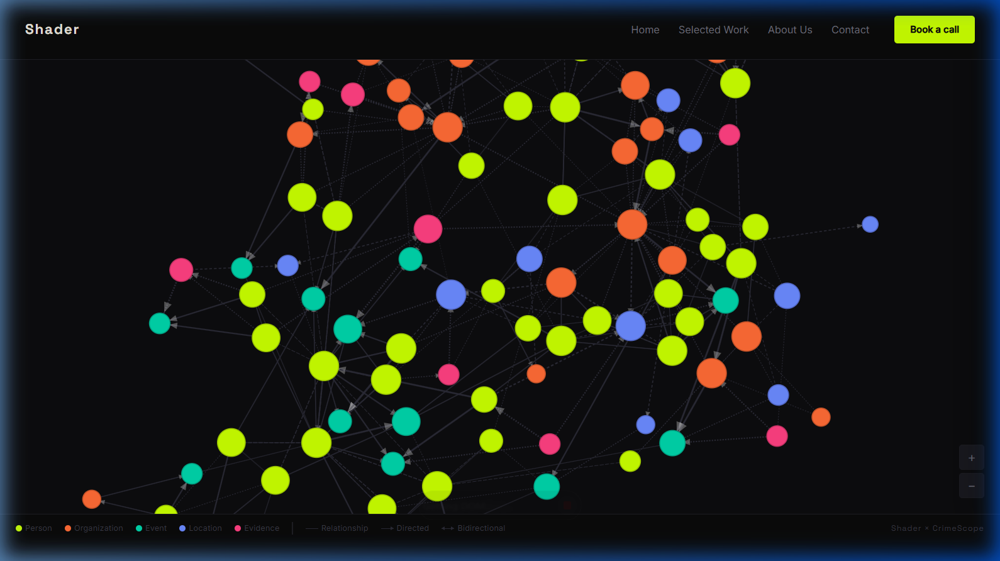

<div align="center">
  
</div>

# CrimeScope — Graph Intelligence Platform

<br/>

> **1,000 AI agents. 8 cognitive archetypes. 30 rounds of adversarial reasoning. One probable cause.**

**CrimeScope** is a premier multi-agent swarm intelligence engine built for criminal event reconstruction and forensic analysis. Using cognitive diversity routing across the most advanced OpenRouter LLMs, it spawns 1,000 highly specialised AI agents that collaboratively process evidence, formulate causal hypotheses, and debate to converge on a single, probable cause.

<div align="center">
  
</div>

<br/>

## 🏛️ Architecture & System Topology

CrimeScope relies on a decoupled, microservices-oriented architecture designed to handle 30 rounds of concurrent multi-agent simulations seamlessly.

```
┌─────────────────┐       ┌─────────────────┐       ┌─────────────────┐
│   Website       │       │   Frontend      │       │   Backend       │
│   (Port 8080)   │       │   (Port 3000)   │       │   (Port 5001)   │
│   Marketing     │       │   Vue 3 + D3    │       │   FastAPI       │
└────────┬────────┘       └────────┬────────┘       └─────────┬───────┘
         │                         │ /api/v1                  │
         └─────────────────────────┴──────────────────────────┘
                                   │
                      ┌────────────┼────────────┐
                      │            │            │
               ┌──────┴──┐   ┌─────┴────┐   ┌───┴──────┐
               │  Neo4j  │   │ ChromaDB │   │ Supabase │
               │  Graph  │   │  Memory  │   │   BaaS   │
               └─────────┘   └──────────┘   └──────────┘
```

## 🛠️ Technology Stack

| Ecosystem | Technology | Purpose |
|---|---|---|
| **Intelligence** | DeepSeek V3/R1, Llama 3.3, Gemini 2.5 Pro | OpenRouter model rotation ensures cognitive diversity |
| **Backend API** | FastAPI (Python 3.11) | High-performance async simulation engine |
| **Knowledge Graph**| Neo4j 5 | Stores entities, evidence, and event timelines |
| **Episodic Memory**| ChromaDB | Agent-specific isolated vector memory spaces |
| **BaaS / State** | Supabase (Postgres) | Persists tracking, snapshots, and auth |
| **Visualization** | Vue 3, Pinia, D3.js v7 | High fidelity, interactive force-directed graph |
| **Web Presence** | Vanilla HTML, CSS, GSAP 3 | Premium, particle-animated marketing landing page |

## 🧠 Cognitive Archetypes

The core of the swarm is divided into 8 distinct epistemic biases to prevent groupthink.

| Archetype | Allocation | Primary Model | Persona Focus |
|---|---|---|---|
| **Forensic Analyst** | 120 agents | DeepSeek V3 | Physical evidence and procedural integrity |
| **Behavioral Profiler** | 100 agents | DeepSeek R1 | Psychological markers and intent |
| **Eyewitness Simulator** | 150 agents | DeepSeek V3 | Observation error modelling / bias testing |
| **Suspect Persona** | 200 agents | DeepSeek V3 | Defensive, deceptive, testing weaknesses |
| **Alibi Verifier** | 80 agents | DeepSeek V3 | Timeline gap analysis |
| **Scene Reconstructor** | 120 agents | DeepSeek V3 | Spatial logistics and movement restrictions |
| **Statistical Baseline** | 130 agents | Llama 3.3 | Base-rate Bayesian reasoning |
| **Contradiction Detector** | 100 agents | DeepSeek R1 | Logic gate inconsistency hunting |

<br/>

<div align="center">
  
</div>

<br/>

## 🚀 Quick Start

Ensure Docker and Docker Compose are installed on your system.

```bash
# 1. Clone the repository
git clone https://github.com/SAICHARAN-TEJ/CRIMESCOPE.git
cd CRIMESCOPE

# 2. Configure Environment
cp .env.example .env
# Important: Add your OpenRouter API key and Supabase credentials in .env

# 3. Boot the environment
docker compose up --build
```
**Access Points:**
- **Dashboard Frontend:** `http://localhost:3000`
- **Marketing Site:** `http://localhost:8080`
- **API Backend:** `http://localhost:5001`
- **Neo4j Browser:** `http://localhost:7474`


## 🖥️ Local Development (Without Docker)

CrimeScope is designed with a **Resilient Configuration Architecture**. It will automatically fall back to **Demo Mode** if external services (Supabase, Neo4j, LLMs) are gracefully unavailable, preventing hard crashes.

```bash
# Backend Setup
cd backend
pip install -e .
uvicorn backend.main:app --reload --port 5001

# Frontend Setup
cd frontend
npm install
npm run dev

# Marketing Website Setup
cd website
npx serve .
```

## 📡 Core API References

| Method | Endpoint | Description |
|---|---|---|
| `GET` | `/api/v1/health` | Service health and configuration validation |
| `POST` | `/api/v1/cases` | Initiate a new investigation |
| `GET` | `/api/v1/cases` | Retrieve investigation history |
| `POST` | `/api/v1/simulate/:id` | Launch swarm simulation |
| `GET` | `/api/v1/simulate/:id/stream` | Multi-agent SSE feed |
| `GET` | `/api/v1/graph/:id` | Serialize graph for D3 consumption |
| `GET` | `/api/v1/report/:id` | Comprehensive Probable Cause Export |

## 📂 Demo Case: Harlow Street

The app natively includes a pre-built demo case: **Harlow Street**. 
A pharmacist vanishes from a multi-story parking garage during a 22-minute CCTV blind spot. 

**Demo features:**
- **18 Graph Entities**: Interactive D3 mapping of persons, locations, items, and events.
- **16 Relationship Edges**: Weighted interactions indicating certainty degrees.
- **10 Core Inquiries**: Provided to the swarm as investigative seeds.
- **4 Hypothesis Matrices**: Generated for adversarial team assessment.

<div align="center">
  
</div>

<br/>

## ⚖️ License
Licensed under the **MIT License**.
