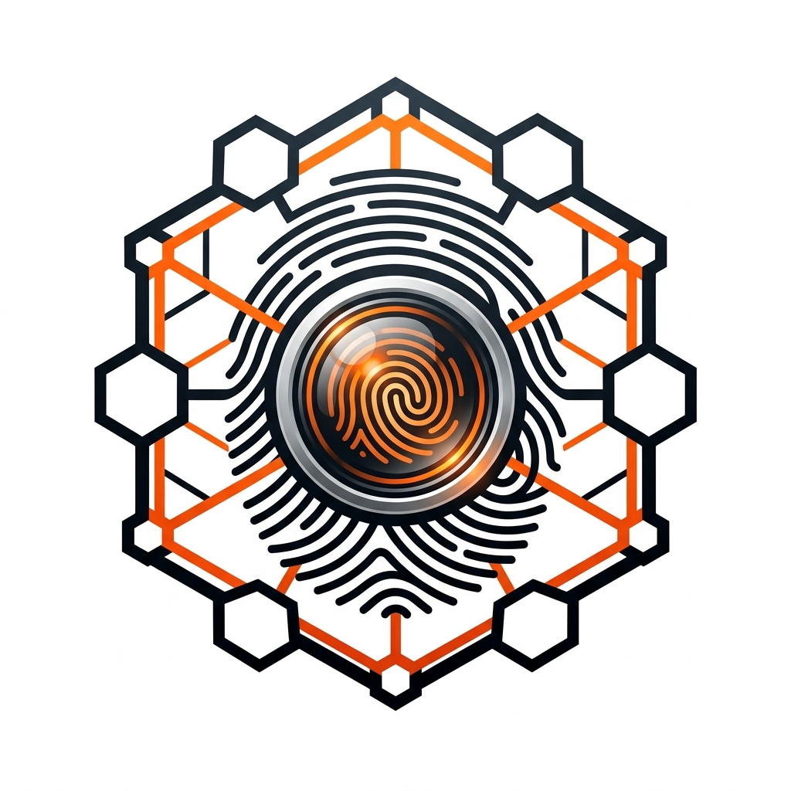
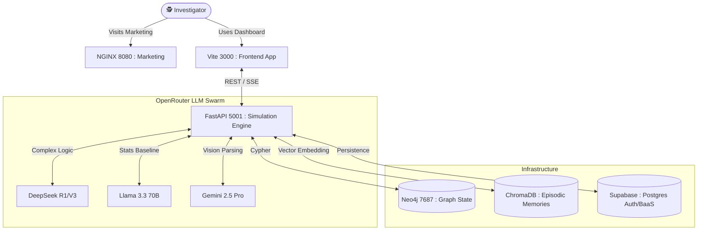

<div align="center">
  
  
  <br/>

  <h3>The Ultimate Graph-Powered Multi-Agent Swarm Intelligence Engine</h3>
  <p>For high-fidelity criminal event reconstruction and causal forensic analysis.</p>

  <p>
    
    
    
    
    <a href="#" target="_blank">
      
    </a>
  </p>
</div>

<br/>

> **"1,000 AI agents. 8 cognitive archetypes. 30 rounds of adversarial reasoning. One probable cause."**

**CrimeScope** is a premier, enterprise-grade swarm intelligence platform built for complex forensic and investigative reasoning. By leveraging massive multi-agent parallel simulation, cognitive diversity routing across state-of-the-art LLMs, and deterministic graph structures, CrimeScope mathematically deduces highly probable sequences of events out of fragmented evidence.

<div align="center">
  
</div>

<br/>

---

## 🔥 Key Features & Capabilities

- **🧬 Adversarial Multi-Agent Swarm**: Deploys up to 1,000 agents to debate, synthesize, and cross-examine evidence concurrently.
- **🕸️ Graph-Deterministic Reasoner**: Unlike flat RAG applications, agents form associations that are materialized into a Neo4j Knowledge Graph where edges carry causal probability weights.
- **🧠 Cognitive Diversity Routing**: Assigns distinct "personalities" to specific model classes (e.g., DeepSeek R1 for logic puzzles, Llama 3.3 for statistical baselines, Gemini 2.5 Pro for vision/spatial tasks) via OpenRouter.
- **🛡️ Resilient Failover Architecture**: Automatic "Demo-Mode" degradation if local databases, Docker dependencies, or API quotas fail, ensuring 100% platform uptime.
- **📈 Editorial-Grade Graph UI**: A custom D3.js v7 physics-based force graph offering frictionless, 60fps pan/zoom interaction and beautiful evidence exploration.
- **📄 Probable Cause Reporting**: Exports a rich, chronologically sorted, legally formatted Probable Cause manifesto at the end of the 30-round simulation.

<br/>

<div align="center">
  
  <p><em>Interactive 60fps D3 Force-Directed Graph tracking entity relations over time.</em></p>
</div>

---

## 🏛️ System Architecture

CrimeScope relies on a decoupled, microservices-oriented topology designed to handle highly demanding adversarial loops seamlessly.



### The 8 Cognitive Archetypes

To prevent groupthink—a known hazard in LLM collaborations—CrimeScope employs highly specialized epistemic bias modules:

1. **Forensic Analyst (120x)**: Fixates purely on physical integrity and chain of custody.
2. **Behavioral Profiler (100x)**: Assesses implicit psychological markers and emotional states.
3. **Eyewitness Simulator (150x)**: Models human observation bias and memory degradation.
4. **Suspect Persona (200x)**: Adopts a hostile, deceptive stance, actively trying to break hypotheses.
5. **Alibi Verifier (80x)**: Cross-references timeframes, creating negative constraints.
6. **Scene Reconstructor (120x)**: Maps spacial logistics (can X travel to Y in 5 minutes?).
7. **Statistical Baseline (130x)**: Uses strict non-narrative Bayesian probability updates.
8. **Contradiction Detector (100x)**: Acts as the "Red Team", specifically hunting logic gate gaps.

---

## 🚀 Setup & Deployment

CrimeScope provides extremely flexible deployment options, offering both fully dockerized containerization and local Python/Node development workflows with resilient fallbacks.

### Option A: Fully Containerized (Recommended for Production)
*Requirements: Docker, Docker Compose*

1. **Clone the repository:**
   ```bash
   git clone https://github.com/SAICHARAN-TEJ/CRIMESCOPE.git
   cd CRIMESCOPE
   ```

2. **Configure your Variables:**
   ```bash
   cp .env.example .env
   ```
   **Populate `.env` with your API Tokens:**
   *Note: If you leave Supabase or Neo4j blank, CrimeScope automatically activates its resilient `DEMO` architecture.*
   ```env
   LLM_API_KEY=sk-or-your_openrouter_key
   SUPABASE_URL=your_supabase_url
   SUPABASE_SERVICE_ROLE_KEY=your_supabase_key
   NEO4J_URI=bolt://neo4j:7687
   NEO4J_AUTH=neo4j/crimescope_password
   ```

3. **Spin up the Swarm:**
   ```bash
   docker compose up --build -d
   ```

**Access Points:**
- **App Dashboard:** [http://localhost:3000](http://localhost:3000)
- **Marketing Landing Page:** [http://localhost:8080](http://localhost:8080)
- **Backend API Docs:** [http://localhost:5001/docs](http://localhost:5001/docs)

<div align="center">
  
</div>

<br/>

### Option B: Local Developer Mode
*Requirements: Node.js 18+, Python 3.11+*

**Backend:**
```bash
cd backend
python -m venv venv
# Windows: venv\Scripts\activate | Mac/Linux: source venv/bin/activate
pip install -e .
uvicorn backend.main:app --reload --port 5001
```

**Frontend:**
```bash
cd frontend
npm install
npm run dev
```

---

## 📂 Featured Demo: The Harlow Street Incident

CrimeScope ships with a sophisticated, pre-processed demo case to showcase the swarm's deductive power instantly.

**Case Brief:** 
A pharmacist vanishes from an urban parking structure inside a 22-minute security camera blindspot.

**What the Swarm Maps:**
- **18 Extracted Entities**: Witnesses, locations, physical objects, timelines.
- **16 Relational Edges**: Mapped probabilities between nodes.
- **10 Core Inquiries**: The procedural seeds provided to the swarm.
- **4 Final Hypothesis Matrices**: Competing narratives tested until a single definitive Probability Report is synthesized.

<div align="center">
  
  <p><em>The final, executable Probable Cause Report synthesized from the 1,000-agent swarm.</em></p>
</div>

---

## 📡 API Reference

Looking to integrate CrimeScope's swarm logic into external infrastructure? The REST layer is heavily documented.

| Method | Endpoint | Use Case |
|---|---|---|
| `GET` | `/api/v1/health` | Diagnostic monitoring (checks Neo4j, Chroma, and LLM statuses). |
| `POST` | `/api/v1/cases` | Ingests a new raw JSON evidence bundle. |
| `POST` | `/api/v1/simulate/{id}` | Signals the SimulationEngine state-machine to transition to `RUNNING`. |
| `GET` | `/api/v1/simulate/{id}/stream` | Consumes the live Server-Sent Events (SSE) from the arguing agents. |
| `GET` | `/api/v1/graph/{id}` | Exports the entire Neo4j layout into structured D3.js JSON elements. |
| `GET` | `/api/v1/report/{id}` | Fetches the finalized markdown sequence of events. |

---

## ⚖️ License & Acknowledgements

**CrimeScope** operates under the open-source **MIT License**.

Designed and optimized for asynchronous multi-agent inference processing. Built on top of the original logical frameworks inspired by state-machine swarm technologies, engineered for enterprise-tier resilience. 

<div align="center">
  <hr/>
  <p><i>Uncovering the Truth, One Graph at a Time.</i></p>
</div>

